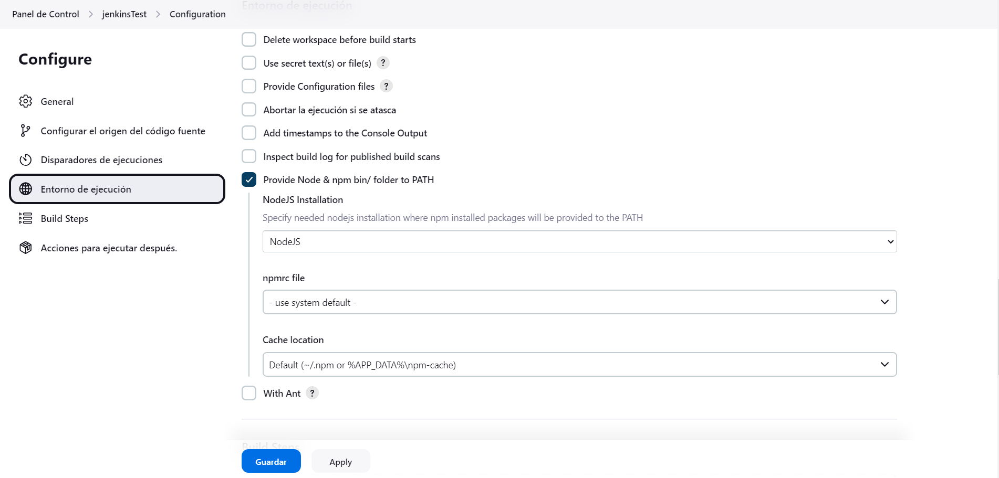

# Jenkins Lab Setup

This repository contains the necessary steps to set up a Jenkins lab environment.

## Prerequisites

- Docker Compose installed on your machine
- Node.js installed on your machine

## Installation

1. Clone this repository to your local machine.

2. Navigate to the project directory (select your path):
    ```bash
    cd /home/steb/infra/jenkins-lab/
    ```

3. Start the Jenkins Docker container using Docker Compose:
    ```bash
    docker-compose up -d
    ```

4. Wait for the Jenkins container to start up. You can check the logs to monitor the progress:
    ```bash
    docker-compose logs -f
    ```

5. Once the Jenkins container is up and running, open a web browser and go to `http://localhost:8080`.

6. Follow the on-screen instructions to complete the Jenkins setup wizard. Make sure to install the necessary plugins.


7. After the setup wizard is complete, create a new Jenkins job:
    - Click on "New Item" on the Jenkins dashboard.
    - Enter a name for the job and select "Freestyle project".
    - Configure the job as needed, including adding any necessary build steps or post-build actions.

 

 

 

 

 

If jenkins is broken, you can restart it by running:

 

8. Save the job configuration and return to the Jenkins dashboard.

9. Run the Jenkins job by clicking on "Build Now" or wait for it to run automatically based on your configuration.

 


10. Once the job is finished, you can access the deployed application by visiting `http://localhost:3001` in your web browser.


I change the port number to 3001 because I have another application running on port 3000.

## Conclusion

Congratulations! You have successfully set up the Jenkins lab environment and deployed the application.

For more information, please refer to the [Jenkins documentation](https://www.jenkins.io/doc/).